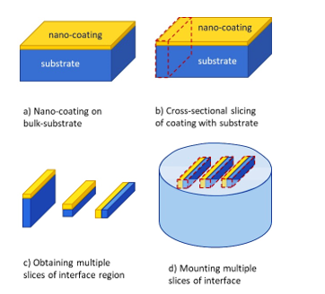

It may be noted that TEM images a region which is very small (order of 10-100s of µm2). Thus, we are able to see only a minute region of the sample. If that region is an artifact or non-representative image of the sample, then we are just left chasing the unknown in the dark. Typically, as the trend is moving towards nano-coatings or nanosurfaces, we would be very much interested in observing the epitaxial films, or assessing response of surface modification technique on the top ~few nm surface. So, to maximise the observation area, we go for cross-sectional TEM. 
The cross-sectional TEM sample preparation is bit tricky. It requires some effort in preparing and placing the regions so that the feature we intend to look under TEM is actually captured. So, first, the bulk sample (Fig. 1a) is sliced in cross-section (Fig. 1b), and multiple pieces of the sample are collected and the excess substrate is removed (Fig. 1c). Now, these samples are placed one below and mounted to form a bulk-substrate (Fig. 1d). But, this new mounted sample contains multiple sample with enhanced region of interest. These can be placed parallel or at multiple locations fr easy identification. Now, the usual slicing (or grinding of the mount) to a thin sheet (< 100 µm), followed by punching out a 3 mm disc. Then, the process of dimpling and ion beam milling are adopted as done routinely for the normal samples. The advantage of cross-sectional TEM samples is to be able to observe relevant portion of the microstructure and enhance the chance of capturing the region of interest for imaging. 
 
Fig. 1: a) Bulk sample of nano-coating on substrate being prepared for b) slicing thin sections with region of interest (say the interface between coating and substrate), c) removal of unwanted substrate region to maximise focus on interface between coatings and substrate, and d) mounting multiple pieces of the region for consequent sample preparation.
It may be noted that direct sectioning of interface region is not possible, and if we use the coating ‘as-is’ (like that in conventional TEM sample preparation), then there is high possibility that the interface between coating and surface may not be captured. The interface may get consumed during sample preparation itself, because the user may not know when to stop grinding from each side. Therefore, cross-sectional TEM sample preparation accounts for this limitation and allows infinite thickness of both the coating and the substrate for user to work with.  
Important Notes: 
1)	An important aspect to note here is that the smaller samples undergo rapid oxidation or surface damage. So, when one cross-sectional sample is prepared, it is advised to keep the available sample in desiccator or a protected atmosphere. Otherwise the very intent of observing interface may not remain the nascent structure (i.e. oxygen can diffuse through and react especially at the interface and may even result in spalling of the coating). 
2)	Mounting of multiple samples to be performed so as to expose the interface region perpendicular to the top-surface.  
3)	In case when the size of samples is very small, the buoyancy may lift the samples up (when pouring resing/epoxy) during mounting. Hence appropriate measures may be taken to ensure that the samples do not change their position, otherwise the change in the levelling may waste the effort of sample preparation of one or more samples. 
4)	Also, ensure that samples are properly aligned and do not change position during mounting. Labelling of samples is very important, otherwise the user might end-up observing irrelevant features as the regions of the coating and substrate may mix-up.  
5)	In this case, electrochemical etching may not work, as you have coating, substrate and mount materials with difference in the etching rates and may require different chemicals. So, usually ion-beam milling is performed for the final sample preparation for observation under TEM. 
<video width="320" height="240" controls>
  <source src="images/exp10-TEM-CS_sample.mp4" type="video/mp4">
  Your browser does not support the video tag.
</video> 
Video on Cross-sectional Sample Preparation
